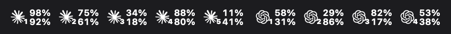
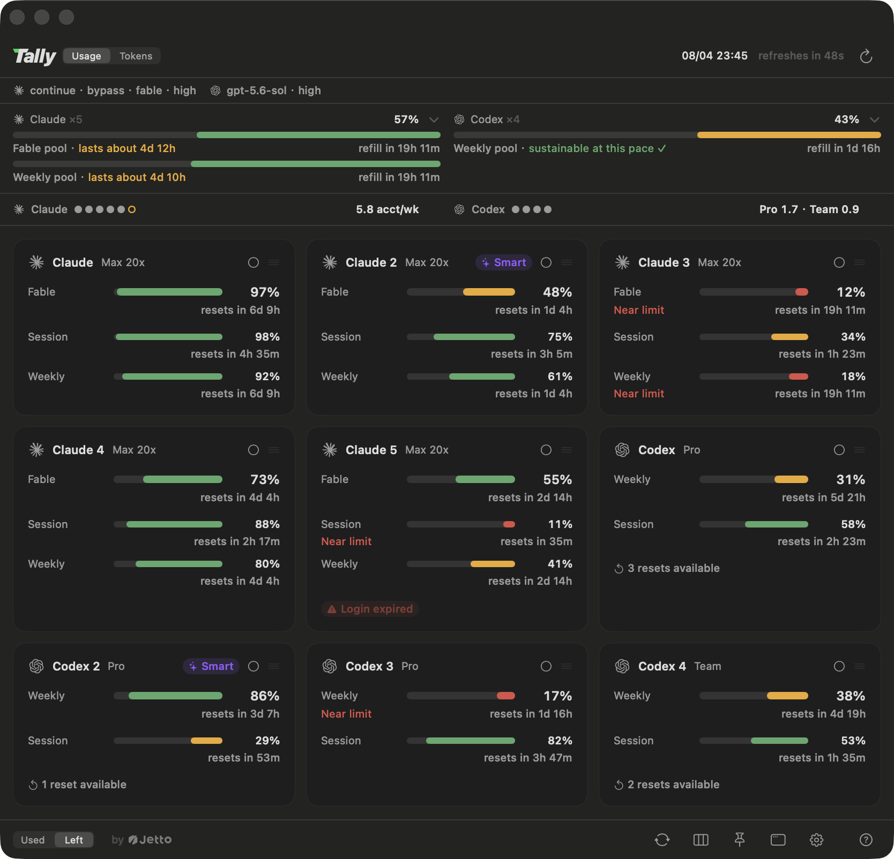
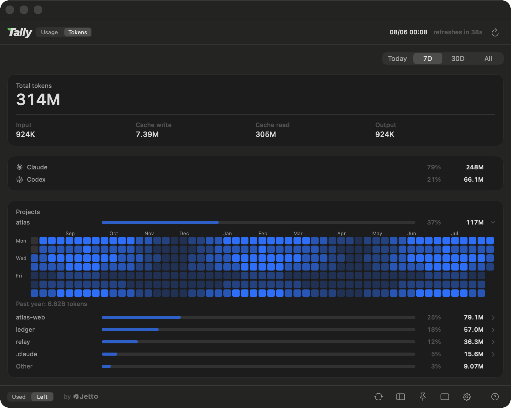
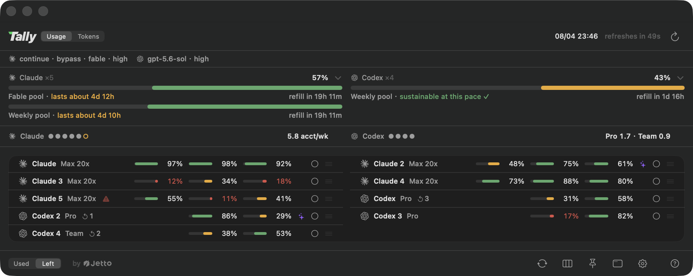

<p align="center">
  <a href="https://github.com/jettoai/tally/releases/latest"></a>
</p>
<h1 align="center">Tally</h1>
<p align="center"><sub>by <a href="https://jetto.ai">Jetto</a></sub></p>

<p align="center">あなたの AI サブスクリプションの残量を、macOS メニューバーでひと目で。<br>さらに、あらゆるセッションを「クォータが最も長く持つアカウント」に乗せるランチャーと、<br>起動したセッションをすべて見守るボードも。</p>

<p align="center">
  
  
  
  <a href="https://github.com/jettoai/tally/releases/latest"></a>
</p>

<p align="center"><a href="https://github.com/jettoai/tally/releases/latest/download/Tally.dmg"><b>⬇ macOS 版をダウンロード（macOS 14+）</b></a></p>

<p align="center"><a href="README.md">English</a> · <a href="README.zh-TW.md">繁體中文</a> · <a href="README.zh-CN.md">简体中文</a> · <b>日本語</b> · <a href="README.ko.md">한국어</a></p>

Tally は **Claude と Codex の AI 使用量（レート制限）を監視する、ネイティブの macOS
メニューバーアプリ**です。**複数の Claude（Max/Pro）や Codex サブスクリプション**を運用していて、
「どのアカウントにまだ余裕があるのか」を推測するのに疲れた人のために作られました。各アカウント
の 5 時間セッション、毎週、最上位モデルのクォータ窓は、それらを 1 つの予算に合算して実測
ペースでどれくらい持つかを予測するフリートゲージの下に横並びで表示され、スマート選択は残量
のパーセンテージだけでなくリセット時刻も加味して、今いちばん余裕のあるアカウントで毎回新しい
セッションを開始します。さらに会話の途中でも動き続けます：レート制限に達したときの
ハンドオフ、フラッグシップモデルが格下げされたときの救済、`/clear` のたびのアカウントの
選び直し、残量が少なくなったアカウントで動く全セッションへの一行の注意喚起、そしてどの
アカウントが消費中かを示す status line シグナルです。仕上げはセッションボードです。Tally が
起動した会話が 1 枚ずつカードになり、どれがあなたの返事を待って止まっているのか、それぞれが
マシンにどれだけ負担をかけているのかが分かります。

<p align="center">
  
</p>

<p align="center">
  
</p>

<p align="center">
  
</p>

## なぜ Tally なのか

メニューバーの使用量メーターはすでに存在します。なかったのは「複数サブスクリプションを
同時に運用する人」のためのものです：

- **アカウントごとのカード。フォールバックチェーンではない。** 各アカウントが独立した
  カードとして横並びに表示されます。マルチアカウントユーザーが本当に知りたいのは
  「どのアカウントにまだ余裕があるか」だからです。
- **サブスクリプションのクォータ。金額の推定ではない。** Tally が表示するのは、ベンダー
  自身が実際に適用している 5 時間／毎週／最上位モデルのクォータ窓です。トークン数から
  ドル換算する推測値ではありません。
- **答えに基づいて動くランチャー。** ダッシュボードの目的は「次にどのアカウントで働くか」
  を決めることです。Tally はその判断を毎回自動で行い、セッションが動いている間もその
  判断をし続けます（上限到達時のハンドオフ、モデル格下げ時の救済、`/clear` のたびの無料の
  選び直し、アカウントの残量が少なくなったときの一行の注意喚起）。
- **セッションそのものを、1 枚のボードに。** セッションのレイヤーまで見ている使用量ツールは
  他にありません。Tally は起動した会話をすべてカードとして表示し、どれがあなたを待って
  止まっているのか、そしてそれぞれがマシンにどれだけ負担をかけているのかを、メモリを
  食っているプロセスまで示します。

## 機能

### ダッシュボード

- **マルチアカウント第一。** `~/.claude*` の各ログインと Codex インストールがそれぞれの
  カードになり、N 個のアカウントを横並びで表示。カードはドラッグで並べ替えでき、
  その順序はすべての画面に適用されます。
- **フリートゲージ。** 各プロバイダのアカウントを 1 つのメーターに集約します。連続した
  バーが合算後の毎週予算を表し、合計はアカウント換算量で示され（「残り 2.9/5」）、次の
  時差回復も表示されます。予測は直近の実測ペースをもとにプールがどれくらい持つかを見積もり、
  リセットのたびに戻るクォータも織り込みます。回復サイクルより速く消費しているときは
  「残り約 4d 10h」、そうでなければ「このペースなら持続可能」と表示されます。アカウントを
  横断してプールする使用量メーターは他にありません。
- **アドバイザー。** もう 1 つアカウントが必要か？ゲージの下にプロバイダごとに 1 行：
  所有するアカウントごとに塗りつぶしのドット、実測ペースがもう 1 つを求めているときは
  中抜きのドットを表示し、読み取るべき数字として週あたりの実需（「5.8 acct/wk」）を
  示します。2 つのプランにまたがるフリートは、200 ドルの席と 20 ドルの席のアカウント週は
  同じ量ではないため、プランごとに分けて表示され（「Pro 1.7・Team 0.9」）、まとめてしまう
  とどのサブスクリプションにも対応しない数字になってしまいます。ホバーするとプランごとの
  内訳、現在の消費レート、枯渇している時間、次の回復が表示され、`tally status --json` は
  同じ内訳を `tierDemands` として公開します。
- **メニューバー表示。** 既定ではプロバイダごとに 1 区画で、そのアカウントをフリートゲージと
  同じプールに合計し、いくつのアカウントを表しているかをバッジで示します。1 アカウント 1 マーク
  にも切り替えられます。どちらもセッションの下に毎週を縦積みで表示し、ホバーするとアカウント、
  完全な数値、そしてプールに入っていないアカウントが分かります。
- **ピン留めできるガラスパネル。** ダッシュボードを常に最前面のすりガラスパネルとして
  ピン留めし、ヘッダーをドラッグして好きな場所へ配置できます。アカウントのカード自体も
  パネルの背景の上にガラスとして描かれます（半透明をオフにしたとき、またはシステムが
  透明度を下げるよう求めているときは不透明になります）。
- **カード、またはアカウントごとに 1 行。** アカウントが半ダースを超えるとカードの
  グリッドは画面に収まらなくなるため、パネルにはもう 1 つの密度があります：各アカウントを
  1 行にまとめ、左側に識別情報、各窓を数字付きの小さなバーとして表示し、起動コントロールは
  アイコンに縮小されます。隠すのは言葉であって事実ではないため、窓の名前、リセット時刻、
  各コントロールの動作はホバーの説明に移動します（Tally はシステムのツールチップを待たず、
  パネル自身のガラスの上に独自に描画します）。各密度はピッカーの裏で自分の列数を記憶し、
  リストの「自動」はカードを数える代わりに画面に何行並ぶかを尋ねます。
- **レイアウトは 1 枚ずつ自分好みに。** フッターの表示オプションカードでは、レイアウト
  タイル（各タイルがそのまま出来上がる配置を描いています）で密度と列数を決め、フリート
  ゲージとアドバイザーのオン・オフを切り替え、プロバイダをゲージの下に折りたたみ、
  カードをプロバイダごとのセクションに収めることもできます。セクション内でもドラッグで
  並べ替えできます。折りたたまれたプロバイダは見出しを残すので、それが元に戻す手がかりに
  なります。画面に収まらないほど大きなフリートは、はみ出す代わりにスクロールします。
- **トークン使用量をプロジェクト別に。** どの画面でもヘッダーのスイッチの裏にトークン
  ビューがあります。今日／7 日／30 日／全期間のトークン合計を、入力・キャッシュ・出力の
  内訳、プロバイダ別の内訳、そしてプロジェクト別のテーブルとともに表示し、エージェントや
  ワークフローのセッションまで、それが担ったプロジェクトへ遡って集計します。プロジェクトの
  行をクリックすると、そのプロジェクト自身のスケールで色分けされたコントリビューション風の
  ヒートマップとして1年分の日次アクティビティが開き、各日の合計はホバーするだけで確認
  できます。データは CLI 自身のローカルトランスクリプトから読み取り、増分キャッシュで
  集計され（新しいデータがなければ更新は 1 秒もかかりません）、あなたのマシンから出ることは
  一切ありません。
- **すべての窓にリセット時刻。** どのリセット表示をクリックしても、全体が
  「あと 2d 4h でリセット」と「07/18 20:00 にリセット」の間で切り替わります。
- **ログインは自分で面倒を見ます。** カードにホバーすると、そのアカウントでサインイン中の
  メールアドレスが表示されます。ログインが失効すると、カードが赤いチップでそれを伝え、通知は
  1 回だけ届き、クリックすればプロバイダ自身のサインインがバックグラウンドで静かに走ります。
  必要なのはブラウザでの承認だけです（表示されるターミナルはフォールバックで、どちらの場合も
  Tally が認証情報に触れることはありません）。
- **アプリを離れずにアカウントを追加。** 設定が次のアカウント用の設定ディレクトリを用意し、
  メインアカウントの設定を共有する既定（一つの設定がすべてのアカウントに使われます）を平易な
  プライバシーの説明とともに提示して、同じ静かなサインインを実行します。ブラウザから戻ると、
  新しいカードが現れます。すでに持っているアカウントも、あとから同じ共有セットアップに
  参加できます（`tally share`、または設定のその行）：会話、inbox、メモがメインアカウントへ
  マージされ、何も削除されません（邪魔になるものは名前を変えてその場に残します）。その行には
  共有の意味も平易に書いてあります：以後はどのアカウントからも、どのアカウントの会話も
  読めるようになります。
- **Codex のリセットバンキングを可視化し、その場で使える。** 蓄積されたレート制限のリセットは
  カードにそのまま表示されます（「3 回分のリセットが利用可能」）。壁にぶつかる前に自分の
  逃げ道を把握できます。クリックひとつで 1 回分を使用でき、実行前にはアカウント名と使用
  コストを明示し、使ってもほぼ無駄になる場合は警告する確認画面が挟まります。最も早く失効
  するクレジットから優先的に使われ、Tally が自動で使うことは決してありません。

<p align="center">
  
</p>

### セッションボード

- **すべての会話をひとつのボードに。** ヘッダーのスイッチの 3 番目の位置、使用状況と
  トークンの隣にあります。監視対象のセッションごとに 1 枚のカードが、それが何か
  （アカウント、モデル、effort、動いている worktree）、いま何をしているか、そして会話が
  どれだけ大きくなったか（「142k context」）を伝えます。状態は 4 つ。外から推測するのでは
  なく、そのセッション自身の supervisor が発表します：作業中、ブロック中、アイドル、
  そして十分に新しい報告が届いていないときの正直な「未報告」です。カードをクリックすると、
  Tally がそのセッションのターミナルタブを前面に出します（Ghostty は tty 経由、それ以外の
  ターミナルはアプリ単位）。
- **ブロック中は、あなたを呼んでいるということ。** 人の手が要る唯一の状態です。Claude Code
  が権限リクエスト、質問、プラン承認を出したまま誰も答えていないとき、カードの縁が赤くなり、
  待ち時間のタイマーが動き、ホバーすると何を求めているかがそのまま表示されます
  （「Claude needs your permission to use Bash」）。サマリー行はボード全体の
  作業中／ブロック中／アイドル／未報告 を数え、色が付くのはブロック中の数だけ、しかも
  それが 0 より大きいあいだだけです。
- **パネルを閉じていても赤い点で分かる。** どれか 1 つでもあなたを待っているセッションが
  あれば、メニューバーの表示に小さな赤い点が現れ、なくなった瞬間に消えます。ホバーすると
  数が分かります。
- **各セッションがマシンをどれだけ使っているか。** 各カードは、そのセッション配下の
  プロセスツリー全体の直近 15 分を保持します：CPU、メモリ、プロセス数をスパークラインで、
  現在値とその期間のピーク付きで表示し、いちばん食っているものを名指しし（「(bun)」
  「(Google Chrome Helper)」）、さらに送り出しているサブエージェントの数、掴んでいる
  ポート（次に `pnpm dev` を打ったときにぶつかる相手）、ディスクへの書き込み速度も示します。
  警告の基準は大きさではなく食い違いです：ビルド中のセッションがコアの 300% を使っていれば
  それはただのビルドですが、ターンが終わって 20 秒後の同じ消費は残りかすなので、琥珀色の
  注記が付きます。マシンのメモリの大半を抱えたセッションには赤い注記が付き、メモリについては
  2 つの証人（ツリー自身の数値と、カーネルが報告する圧力）がそろって初めて Tally はそう
  言います。警告が出るには読み取りが数秒続く必要があるので、1 回の GC ポーズで赤く光ることは
  ありません。セッションのレイヤーを読む使用量ツールは他になく、プロセスのレイヤーとなれば
  なおさらです。
- **覚えられるボード。** ステータス順の並びはボードを開いた瞬間に決まり、そこで固定されます
  （1 秒に 2 回並び替わるボードは誰にも覚えられません）。カードを 1 枚ドラッグすれば、
  並びはあなたのものになります。フィルタで接続中のセッションだけに絞ることも、すべて表示
  することもでき、未報告のものは薄く表示されますがクリックはできます。ボードは
  ダッシュボードとは別に、自分の列数も覚えています。

<p align="center">
  
</p>

### 起動コントロールプレーン

- **スマート選択。** 新しいセッションは、5 時間・毎週・最上位モデルの各クォータ窓の中で
  「消費レートが最も高い」アカウントで開始します（残量パーセンテージをリセットまでの時間で
  割って算出）。まもなくリセットされるクォータを優先的に使い切り（未使用のまま消えるため）、
  数日単位で持たせる必要のあるクォータは温存します。ヒステリシスにより、ノイズレベルの差で
  アカウント間を行ったり来たりすることもありません。パネルのバッジが現在の選択先を示し、
  理由は tooltip に表示されます。
- **プロバイダごとに 3 つのモード。** スマート（起動のたびにアルゴリズムが判断）、手動
  （カード上の丸をクリックしてアカウントを固定。チェックをクリックするとスマートに即時
  復帰、実行中のセッションにも適用）、オフ（ダッシュボードのみで起動には関与しない）。
- **セッション途中のフォローアップ。** 使用上限に達すると、tally は次に良いアカウントで
  *同じ会話*を再開します（10 分間に 3 回のヒューズ内蔵、`--no-handoff` または
  `TALLY_AUTO_HANDOFF=0` で無効化可）。サーバーが黙ってモデルを格下げした場合は、元の
  モデルをまだ提供できる兄弟アカウントが会話を引き継ぎ、誰も提供できないときだけ設定済みの
  フォールバック組み合わせが適用されます。緊急でない切り替えは、ターン間の静かなタイミングを
  待ちます。
- **ウィンドウの境目は、ただで引っ越せる瞬間。** `/clear` と打った瞬間、会話は空です：
  中断するターンもなく、読み直す context もなく、失うものもありません。だから Tally は
  その場でもう一度アカウントの問いを立て、起動ごとではなく作業の単位ごとに選び直し、
  いま乗っているアカウントが枯れかけていれば、新しいウィンドウを最も余裕のあるアカウントへ
  移します。きっかけは推測ではなく事実です。Claude Code 自身の status line が新しい会話 id
  を報告するので、プロンプトに飲み込まれた `/clear` では何も動きません。
- **残量が減ったアカウントは、自分でそう言います。** アカウントのボトルネックとなる窓が
  15% を切ると、Tally はそのアカウントで動くすべてのセッションの入力欄に一行を打ち込み、
  どの窓が詰まっているのか、いつ回復するのか、何セッションで分け合っているのか、そして
  どの兄弟アカウントにまだ余裕があるのかを伝えます：「切りのいいところで区切ってアカウントを
  切り替えるか、リセットを待ってください。」どのアカウントにも余裕がないときは、正直に
  そう言います。再び声を上げるのは 30% に戻ってからなので、境界線上を漂うアカウントが何度も
  話しかけることはありません。まもなくリセットされる窓は満タン扱いです。すぐ回復する
  クォータを理由に手を止めさせるのは、あなたの邪魔にしかならないからです。
- **動いているセッションに指示を出す。** `tally session send "<テキスト>"` は、監視対象
  セッション自身のターミナルに一行打ち込んで Enter を押します。あなたがそこで打ったのと
  まったく同じです：`/clear`、`/compact`、権限プロンプトへの返事も。最初の安全なタイミング
  （セッションが待機中、アイドル、またはターンを終えた直後）で着地し、そのタイミングがまだ
  来ていなければ待ち行列に入り（キューに入れば成功。拒否は即座に返り、理由も伝えます）、
  ターンを中断することはなく、そのウィンドウで打っている人と取り合うこともありません。
  セッションが送り出したサブエージェントが順番を塞ぐこともありません。`tally session clear`
  は同じ動作に、打鍵では持てない力をひとつ足したものです：そのセッションのアカウントが
  枯れかけていて兄弟アカウントに余裕があれば、クリアされたウィンドウは同じ動作のまま、
  より良いアカウントで開き直します。書き込まれるのはすべてあなた自身のターミナルの中だけで、
  ベンダーへ送られることはなく、上限は 200 bytes、ローカルに記録されます。
- **並行する作業ライン。** `tally claude -w <名前>` はセッションを git worktree で開き、
  必要なら `../<repo>-<名前>` を作成し、プロジェクトの Claude メモリをリンクし、その repo
  自身のセットアップスクリプトを実行します。`-w` だけを付ければ既存のラインが一覧され、
  そこから選べます。`tally worktree tree / list / root / remove` がそれらを取りまとめ、
  `remove` はマージ済みのラインをきれいに畳みます：そのラインのセッションを終了し、
  worktree とブランチを削除し、指定がなければトランスクリプトは残します。
- **会話ひとつ、あるいは repo ひとつを固定する。** `tally account <名前>` は、それを実行した
  セッションを現在のターンの終わりに別のアカウントへ移し、会話はそのままに、
  `tally account --auto` が解放するまでそこに留めます。`tally model <モデル> [effort]` は
  この会話だけをそのモデルで最後まで走らせ、あらゆる再起動（上限ハンドオフ、リロード、
  アプリ更新）を越えて生き延びます。supervisor が自身のコマンドラインから再起動したあとでは、
  Claude Code 自身の `/model` に約束できないことです。`tally project set --model <m>
  [--account <n>]` は、この repo とそのすべての worktree が何で起動するかを宣言します。
  アプリの既定値はそれに譲り、あなたが打ったフラグはそれに勝ちます。Claude Code の中からは、
  同梱の `/tally` コマンドがモデルを起こさずにアカウントやモデルを切り替え、引数なしの
  `/tally-account` ／ `/tally-model` はアプリ自身が描くネイティブのピッカーパネルを
  呼び出します：ひとつのリスト、ワンクリック、答えは CLI へ返ります。
- **設定を一度変えれば、全セッションが読み直す。** `tally reload` は監視対象のセッションを
  それぞれ次の静かなタイミングで再起動するので、書き換えたフック、スキル、CLAUDE.md が、
  ターミナルを一つずつ回らなくてもすべての画面に届きます。会話は残り（再起動は上限
  ハンドオフと同じ resume 経路を通ります）、ストリーミング中や入力中のセッションはそのままに
  され、どのみち再起動するセッションは、枯れかけたアカウントからついでに引き上げられます。
- **設定画面の起動デフォルト。** デフォルトの許可モード、起動モード（continue か new か）、
  モデルと reasoning effort を 1 組として、さらに別のフォールバック組み合わせ（フォールバック
  モデル＋独自の effort＋追加フラグ）を設定できます。自分でフラグを指定しなかったときだけ
  注入されるので、自分で渡した引数が常に優先されます。
- **モデルを一度変えれば、全セッションが追従。** デフォルトのモデルや effort を切り替えると、
  実行中の監視対象セッションはそれぞれ次の静かなタイミングで同じ会話のまま追従します。
  ターミナルを回って `/model` を打つ必要はありません。自分で指定したモデルや effort には
  決して触れず、`--no-follow` で個別に追従を外せます。
- **シェル統合。** ワンクリックで PATH シムをインストールし、裸の `claude` / `codex`
  コマンドも起動ポリシーに従うようにします。ワンクリックできれいに削除できます。
- **status line 統合。** Claude Code の status line に紫色の ✦ Tally シグナル（このセッションが
  Tally 配下で動いていることを示す）、現在のアカウント名、そしてこのセッションが実行中の
  モデルと effort が追加されます。フルクォータ表示をオンにすると、アプリと同じ配色で
  メーターバー、パーセント、リセットまでのカウントダウンをまとめて表示します。対象は
  5 時間の窓とこのアカウントの毎週予算で、パネルの 使用量／残り の切り替えに連動します。
  合算後のフリート表示はアプリと `tally status` に残ります。既存のカスタム status line はそのまま動き続け、
  シグナルが追記されるだけです。削除時にはバイト単位で元の状態に復元され、Tally を
  アンインストールせずに削除しても動作し続けます。
- **Claude Code スキル。** ワンクリックで各 Claude アカウントの skills フォルダに小さな
  スキルを配置し、agent セッションが `tally status --json` からクォータの質問に答え、
  アカウントを選べるようにします（重いマルチエージェント作業の前にボトルネックの窓を
  確認することも教えます）。削除時も同じくきれいに元へ戻ります。同じインストールで
  `/tally` コマンドも追加され、ネイティブのピッカーパネルを支える MCP サーバーも
  登録されます。
- **`tally` CLI。** 起動：`tally claude [引数…]`、`tally claude --account <名前>`、
  `tally claude -w <名前>`（worktree）、`tally resume`（このディレクトリの最新の会話を
  別のアカウントへ移動）、`tally add <provider>`（もう 1 アカウントログイン：次の空き番号の
  選定も設定ディレクトリの作成もおまかせ。メインアカウントの一式、CLAUDE.md/AGENTS.md、
  skills、hooks、agents、設定、会話履歴はデフォルトでシンボリックリンクされ、ひとつの
  セットアップを全アカウントで使い回せます。`--no-share` でオプトアウト）、`tally share`
  （すでに持っているアカウントを同じ一式に載せる）。確認：`tally status`（`--json` を
  付けるとバージョン付きの機械可読レポートを出力：全アカウントの窓とリセット時刻、いま
  起動するとどのアカウントに着地するか、そして監視対象の各セッションが何を実行しているかが
  分かり、自作のスクリプト、フック、agent skill にそのまま渡せます）、
  `tally worktree tree|list|root`、`tally best-dir <provider>`。操作：`tally account`、
  `tally model`、`tally project`、`tally session send|clear`、`tally reload`。
  メンテナンス：`tally update`、`tally completion zsh`、`tally worktree remove`。
  すべてスクリプトフレンドリーです。

### 見た目と作り

- **5 言語対応。** English、繁體中文、简体中文、日本語、한국어。アプリ内で即時切り替え。
- **ネイティブ。** Swift 6 + SwiftUI + AppKit、Electron なし。唯一のサードパーティ依存は
  macOS 標準のアップデートフレームワーク [Sparkle](https://sparkle-project.org) のみで、
  アプリと CLI はそれぞれ単一バイナリ。

## 仕組み（そして決してしないこと）

- **資格情報には一切触れない。** Tally はトークンにも Keychain の秘密にもベンダーの
  エンドポイントにも触れません。使用量は各プロバイダの**公式 CLI 自身**
  （`claude -p "/usage"` と `codex app-server`）を通じて読み取ります。公式クライアントが
  自身のファーストパーティの身元と自己管理の資格情報でベンダーと通信します。アカウント検出は
  「ログインが存在するか」の属性レベルの確認のみで、中身は決して読み出しません。
- **読み取り専用、ただし明示された例外が 1 つ。** `claude auth login` は OAuth のやり取りを
  終えるとそこで止まるため、Tally が作成してサインインまで済ませた config home も、
  最初のセッションでは初回起動ウィザード（テーマ選択と、たった今サインインしたばかりの
  アカウントへのサインイン要求）に出会うことになります。そこで Tally 自身が行った
  サインインの後（アカウントの追加、またはカードからの更新）、Claude Code 自身が
  「ウィザードは完了した」と記録するフィールド `hasCompletedOnboarding` を、その home の
  状態ファイルにマージします。Tally が新規作成する home には、既存アカウントですでに
  答えたフォルダ信頼の回答もあらかじめ入れておきます。あくまでマージであって置き換えでは
  なく、解析できないファイルは書き換えずに拒否し、ウィザードを終えた home はバイト単位で
  そのまま残します。資格情報には決して触れず、他の home をスキャンして修復することも
  決してありません。
- **ポーリングは常にひとつ。** CLI を実行するのはメニューバーアプリだけです（デフォルト
  1 分間隔、2／5／15 分に緩和可能）。`tally` ランチャーはローカルのスナップショット
  （`~/.tally/snapshot.json`：パーセンテージとパスのみ、トークンは決して含まない）を
  読むだけなので、ターミナルを 10 個開いても追加の読み取りはゼロです。
- **自分のアカウントだけ。** マルチアカウントとは、*あなた自身*が支払い、*あなたの*マシン上に
  あるサブスクリプションのことです。Tally はプロキシも、アカウントプールの共有も、転売も
  しません。アカウント切り替えは、あなたがすでに所有している config ディレクトリで公式 CLI を
  起動するだけです。
- **完全ローカル。** テレメトリなし、サーバーなし。使用量の読み取り以外、何もマシンの外へ
  出ません。

## 動作要件

- macOS 14+
- サインイン済みの [Claude Code](https://claude.com/claude-code)。追加アカウントは config
  ディレクトリを増やすだけ（`CLAUDE_CONFIG_DIR=~/.claude2 claude` でログイン）、および／または
- サインイン済みの Codex CLI（`~/.codex`）

## インストール

[Releases](https://github.com/jettoai/tally/releases/latest) から最新の公証済み DMG を
ダウンロードし、**Tally.app** をアプリケーションフォルダへドラッグして起動してください。
以降のアップデートはアプリ内で自動的に届きます。

`tally` CLI を使うには、アプリに同梱されたバイナリを PATH にリンクします：

```sh
ln -s /Applications/Tally.app/Contents/Helpers/tally /usr/local/bin/tally
```

<details>
<summary>ソースからビルドする場合</summary>

```sh
brew install xcodegen   # 初回のみ
git clone https://github.com/jettoai/tally && cd tally
xcodegen generate
xcodebuild build -project Tally.xcodeproj -scheme Tally -configuration Release -destination 'platform=macOS'
xcodebuild build -project Tally.xcodeproj -scheme TallyCLI -configuration Release -destination 'platform=macOS'
```

`Tally.app` を DerivedData からアプリケーションフォルダへ移動し、`tally` バイナリを
PATH に置きます：

```sh
ln -s <build-products>/tally /usr/local/bin/tally
```

</details>

シンボリックリンクやエイリアスをまったく使わない方法もあります。**設定 → Integrations**
では各項目をワンクリックでインストールでき、削除もきれいに行えます。まとめて扱う
「すべてインストール」スイッチも上にあります：CLI ツール、shell シム（裸の `claude` /
`codex` もポリシーに従うようにする）、status line シグナル、セッションボードの通知フック、
サブエージェント数のフック、そして `/tally` コマンド付きの Claude Code スキル。フックの行は
どれも同じ約束を守ります：そのイベントにすでに登録していたものはそのまま動き続け、削除で
外れるのは Tally 自身のエントリだけです。既存アカウントを共有の一式に載せる行もここに
ありますが、「すべてインストール」からは意図的に外してあります。これは config home の間で
会話を移動させる操作であり、「全部オンにする」という意味の一押しが、それも意味するとは
限らないからです。

お好みで shell エイリアスも：

```sh
alias c='tally claude'
alias cc='tally claude --continue'
```

## ローカライズ

Tally は English、繁體中文、简体中文、日本語、한국어 を同梱し、設定から再起動なしで
即時に切り替えられます。すべての文字列はひとつの Xcode String Catalog
（[`Tally/Resources/Localizable.xcstrings`](Tally/Resources/Localizable.xcstrings)）に
あり、言語の追加は「列をひとつ埋める」だけの単一ファイル PR です。基準は「翻訳ではなく
OS のネイティブ文言のように読めること」。既存言語の修正も新しい言語と同じく歓迎します。

## コントリビュート

Issue と Pull Request を歓迎します。ビルド環境は上の「ソースからビルドする場合」を
参照してください。プロジェクトを健全に保つ約束事が二つあります：

- `project.yml` が唯一の情報源です。`Tally.xcodeproj` は XcodeGen が生成するもので、
  手で編集しません。
- ユーザーに見える文字列は必ず `L("…")` ヘルパー経由で String Catalog に入れ、
  5 言語すべてを埋めます。

PR はひとつの意図に絞り、「なぜ」を説明に書いてください。

## FAQ

**Tally は ccusage や他の使用量トラッカーと何が違うの？**
[ccusage](https://github.com/ryoppippi/ccusage) のようなツールはターミナル CLI で、ローカル
ログからトークン支出を推定します。多くのメニューバーメーターは単一アカウントのみ対応です。
Tally はネイティブ GUI で、ベンダーが実際に適用するクォータウィンドウ（5 時間、週間、
フラッグシップモデル）を複数の Claude / Codex アカウントにまたがって同時に表示し、その数字に
基づいて動くランチャーも備えています。トークンビューは「どれだけ使ったのか、何に使ったのか」
という問いにも、プロジェクト単位で、ローカルのトランスクリプトから直接答えます。金額の推測は
しません。そしてセッションボードは、そのどれよりも一段深く踏み込みます。動いているセッションが
1 枚ずつカードになり、どれがあなたを待って止まっているのか、それぞれがマシンにどれだけ負担を
かけているのかが、メモリを抱えているプロセスまで分かります。読み取り専用で、自分で契約した
有料サブスクリプションのみが対象です。

**なぜ macOS がキーチェーンの許可を求めてこないの？**
Tally は資格情報を読まないからです。使用量は公式 CLI 経由で取得し、アカウント検出は
属性レベルの Keychain 確認のみ（秘密を取り出さない → 許可ダイアログが出ない）。

**すべてのアカウントが上限に達したら？**
劇的なことは起きません。ダッシュボードはそのまま表示し、`tally claude` は警告して素の
CLI を起動し、自動ハンドオフはループせずその場に留まります。

**自動ハンドオフで会話は失われない？**
失われません。次のアカウントで同じセッションの記録を再開します（追記のみ。元の記録が
変更されることはありません）。中断されたツール呼び出しは、切り替え後に一度だけ再実行される
ことがあります。

**status line 統合はカスタム status line を壊しませんか？**
壊しません。あなた自身のコマンドは同じ session JSON を受け取ったまま、これまでどおり
実行され続けます。Tally はそこにシグナルを追記するだけで、すでにアカウント名を表示
している場合はその部分を省略します。削除時にはバイト単位で元の登録に復元され、万一
tally バイナリが消えていても、あなたのコマンドを直接実行する形にフォールバックします。

## 謝辞

Tally は、この分野を切り拓いた優れたプロジェクトの道の上にあります：

- [ccusage](https://github.com/ryoppippi/ccusage)：Claude Code のローカルログを使用量の
  洞察に変えた先駆けであり、開発者がどれほど自分の数字を見たいかを示しました。
- [OpenUsage](https://github.com/robinebers/openusage) と
  [AIUsage](https://github.com/sylearn/AIUsage)：メニューバーで一目で分かる使用量メーター
  という形を確立しました。Tally は、その一目を複数アカウントに同時に向けたくて生まれました。
- [Sparkle](https://sparkle-project.org)：アプリ内アップデートを支えています。

## ライセンス

[MIT](LICENSE) © [jetto](https://jetto.ai)
