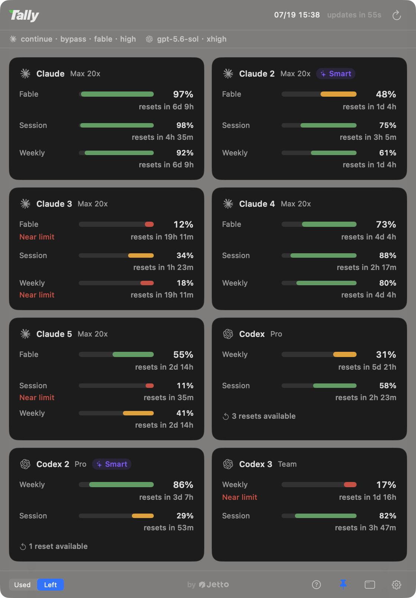

<p align="center">
  <a href="https://github.com/jettoai/tally/releases/latest"></a>
</p>
<h1 align="center">Tally</h1>

<p align="center">보유한 모든 AI 구독의 잔여 한도를 macOS 메뉴 막대에서 한눈에.<br>항상 「여유가 가장 많은 계정」으로 작업을 시작해 주는 CLI까지.</p>

<p align="center">
  
  
  
  <a href="https://github.com/jettoai/tally/releases/latest"></a>
</p>

<p align="center"><a href="https://github.com/jettoai/tally/releases/latest/download/Tally.dmg"><b>⬇ macOS용 다운로드 (macOS 14+)</b></a></p>

<p align="center"><a href="README.md">English</a> · <a href="README.zh-TW.md">繁體中文</a> · <a href="README.zh-CN.md">简体中文</a> · <a href="README.ja.md">日本語</a> · <b>한국어</b></p>

Tally는 **Claude와 Codex의 AI 사용량(사용 한도)을 모니터링하는 네이티브 macOS 메뉴
막대 앱**입니다. **여러 개의 Claude(Max/Pro)와 Codex 구독**을 운용하면서 「어느 계정에
아직 여유가 있지?」를 추측하는 데 지친 사람을 위해 만들어졌습니다. 각 계정의 5시간
세션, 주간, 최상위 모델 쿼터 창을 나란히 보여 주고, `tally claude`는 여유가 가장 많은
계정으로 다음 Claude Code 세션을 시작하며, 한도에 걸리면 대화 도중에도 자동으로 계정을
전환합니다.

<p align="center">
  
</p>

<p align="center">
  
</p>

## 왜 Tally인가

메뉴 막대 사용량 미터는 이미 존재합니다. 없었던 것은 「여러 구독을 동시에 운용하는
사람」을 위한 것입니다:

- **계정마다 카드 하나, 폴백 체인이 아님.** 각 계정이 독립된 카드로 나란히 표시됩니다.
  멀티 구독 사용자가 정말 알고 싶은 것은 「어느 계정에 아직 여유가 있는가」이기 때문입니다.
- **구독 쿼터, 비용 추정이 아님.** Tally가 보여 주는 것은 벤더가 실제로 적용하는
  5시간/주간/최상위 모델 쿼터 창입니다. 토큰 수로 달러를 역산한 추측치가 아닙니다.
- **답에 따라 움직이는 런처.** 대시보드의 존재 이유는 「다음에 어느 계정으로 일할지」를
  정하는 것입니다. `tally claude`가 그 결정을 매번 자동으로 내려 줍니다.

## 기능

- **멀티 계정 우선.** `~/.claude*`의 각 로그인과 Codex 설치가 각각의 카드가 되어 N개의
  계정을 나란히 표시합니다. 카드는 드래그로 순서를 바꿀 수 있고, 그 순서는 모든 화면에
  적용됩니다.
- **메뉴 막대 표시.** 계정별 브랜드 마크에 세션/주간 퍼센트를 세로로 쌓아 표시. 같은
  프로바이더의 여러 계정에는 작은 번호 배지가 붙고, 호버하면 모든 계정의 전체 수치를
  볼 수 있습니다.
- **고정 가능한 글래스 패널.** 대시보드를 항상 위에 떠 있는 반투명 패널로 고정하고,
  헤더를 드래그해 원하는 위치로 옮기세요.
- **모든 창에 리셋 시각.** 아무 리셋 표시나 클릭하면 전체가 「2d 4h 후 리셋」과
  「07/18 20:00 리셋」 사이에서 전환됩니다.
- **`tally` CLI.**
  - `tally claude [인자…]`: 실측 기준 여유가 가장 많은 계정으로 Claude Code를 실행.
    인자는 그대로 전달됩니다.
  - **자동 핸드오프**: 세션 도중 사용 한도에 도달하면 tally가 깔끔하게 종료하고 최적
    계정을 다시 골라 같은 터미널에서 *같은 대화*를 이어 갑니다. 10분당 3회 퓨즈 내장,
    `--no-handoff` 또는 `TALLY_AUTO_HANDOFF=0`으로 끌 수 있습니다.
  - `tally resume`: 같은 핸드오프의 수동 원라이너 버전.
  - `tally claude --account <이름>`: 직접 고르고 싶을 때 계정을 명시 지정.
  - `tally status` / `tally best-dir <provider>`: 스크립트나 셸에서 확인용.
- **5개 언어.** English, 繁體中文, 简体中文, 日本語, 한국어. 앱 안에서 즉시 전환.
- **네이티브, 의존성 제로.** Swift 6 + SwiftUI + AppKit. Electron 없음, 외부 패키지
  없음, 앱과 CLI 각각 단일 바이너리.

## 동작 방식 (그리고 절대 하지 않는 것)

- **자격 증명에 일절 접근하지 않음.** Tally는 토큰도, Keychain 비밀도, 벤더 엔드포인트도
  건드리지 않습니다. 사용량은 각 프로바이더의 **공식 CLI 자체**(`claude -p "/usage"`와
  `codex app-server`)를 통해 읽습니다. 공식 클라이언트가 자신의 퍼스트파티 신원과 스스로
  관리하는 자격 증명으로 벤더와 통신합니다. 계정 탐지는 「로그인이 존재하는가」의 속성
  수준 확인뿐이며, 내용을 읽어 내지 않습니다.
- **폴링은 언제나 하나.** CLI를 실행하는 것은 메뉴 막대 앱뿐입니다(기본 5분 간격, 최소
  1분). `tally` 런처는 로컬 스냅숏(`~/.tally/snapshot.json`: 퍼센트와 경로만, 토큰은
  절대 없음)만 읽으므로 터미널을 열 개 열어도 추가 읽기는 없습니다.
- **오직 당신의 계정만.** 멀티 계정이란 *당신이* 결제하고 *당신의* 기기에 있는 구독을
  말합니다. Tally는 프록시도, 계정 풀 공유도, 재판매도 하지 않습니다. 계정 전환은 이미
  소유한 config 디렉터리로 공식 CLI를 실행하는 것뿐입니다.
- **완전 로컬.** 텔레메트리 없음, 서버 없음. 사용량 읽기 외에는 아무것도 기기 밖으로
  나가지 않습니다.

## 요구 사항

- macOS 14+
- 로그인된 [Claude Code](https://claude.com/claude-code). 추가 계정은 config 디렉터리를
  하나 더 만들면 됩니다(`CLAUDE_CONFIG_DIR=~/.claude2 claude`로 로그인). 그리고/또는
- 로그인된 Codex CLI (`~/.codex`)

## 설치

[Releases](https://github.com/jettoai/tally/releases/latest)에서 최신 공증 DMG를
다운로드하고 **Tally.app**을 응용 프로그램 폴더로 드래그한 뒤 실행하세요. 이후
업데이트는 앱 안에서 자동으로 도착합니다.

`tally` CLI를 쓰려면 앱에 번들된 바이너리를 PATH에 링크하세요:

```sh
ln -s /Applications/Tally.app/Contents/Helpers/tally /usr/local/bin/tally
```

<details>
<summary>소스에서 빌드하기</summary>

```sh
brew install xcodegen   # 최초 1회
git clone https://github.com/jettoai/tally && cd tally
xcodegen generate
xcodebuild build -project Tally.xcodeproj -scheme Tally -configuration Release -destination 'platform=macOS'
xcodebuild build -project Tally.xcodeproj -scheme TallyCLI -configuration Release -destination 'platform=macOS'
```

`Tally.app`을 DerivedData에서 응용 프로그램 폴더로 옮기고 `tally` 바이너리를 PATH에
두세요:

```sh
ln -s <build-products>/tally /usr/local/bin/tally
```

</details>

선택 사항인 셸 별칭:

```sh
alias c='tally claude'
alias cc='tally claude --continue'
```

## 현지화

Tally는 English, 繁體中文, 简体中文, 日本語, 한국어를 내장하며 설정에서 재시작 없이
즉시 전환됩니다. 모든 문자열은 하나의 Xcode String Catalog
([`Tally/Resources/Localizable.xcstrings`](Tally/Resources/Localizable.xcstrings))에
있어, 언어 추가는 「열 하나를 채우는」 단일 파일 PR입니다. 기준은 「번역이 아니라 OS의
네이티브 문구처럼 읽힐 것」. 기존 언어의 교정도 새 언어만큼 환영합니다.

## 기여하기

이슈와 풀 리퀘스트를 환영합니다. 빌드 환경은 위의 「소스에서 빌드하기」를 참고하세요.
프로젝트를 건강하게 유지하는 두 가지 관례가 있습니다:

- `project.yml`이 유일한 진실의 원천입니다. `Tally.xcodeproj`는 XcodeGen이 생성하며
  손으로 편집하지 않습니다.
- 사용자에게 보이는 새 문자열은 반드시 `L("…")` 헬퍼를 거쳐 String Catalog에 넣고,
  5개 언어를 모두 채웁니다.

PR은 하나의 의도로 좁히고, 「왜」를 설명에 적어 주세요.

## FAQ

**왜 macOS가 키체인 권한을 묻지 않나요?**
Tally는 자격 증명을 읽지 않기 때문입니다. 사용량은 공식 CLI를 통해 가져오고, 계정
탐지는 속성 수준의 Keychain 확인뿐입니다(비밀을 꺼내지 않음 → 권한 대화 상자 없음).

**모든 계정이 한도에 도달하면?**
극적인 일은 없습니다. 대시보드는 그대로 보여 주고, `tally claude`는 경고 후 순정 CLI를
실행하며, 자동 핸드오프는 루프 없이 제자리에 머뭅니다.

**자동 핸드오프로 대화를 잃지 않나요?**
잃지 않습니다. 다음 계정에서 같은 세션 기록을 이어 갑니다(추가 기록만 하며 원본 기록은
절대 수정되지 않음). 중단된 도구 호출은 전환 후 한 번 다시 실행될 수 있습니다.

## 라이선스

[MIT](LICENSE) © [jetto](https://jetto.ai)
