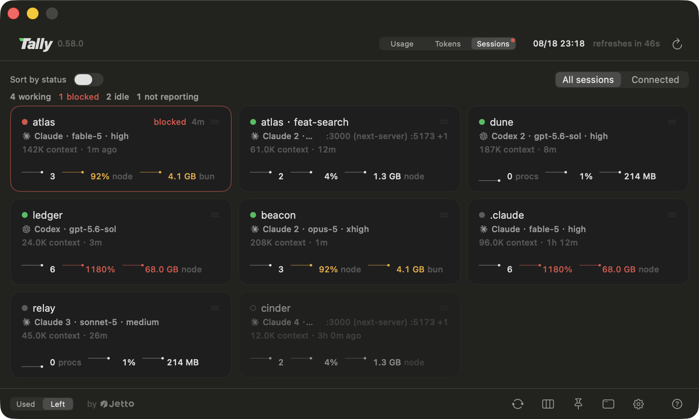

<p align="center">
  <a href="https://github.com/jettoai/tally/releases/latest"></a>
</p>
<h1 align="center">Tally</h1>
<p align="center"><sub>by <a href="https://jetto.ai">Jetto</a></sub></p>

<p align="center">你所有的 AI 訂閱額度，一眼看盡，就在 macOS 選單列，<br>還有一個啟動器，讓每個 session 都跑在餘量撐最久的帳號上，<br>以及一塊看板，盯著它啟動過的每一段 session。</p>

<p align="center">
  
  
  
  <a href="https://github.com/jettoai/tally/releases/latest"></a>
</p>

<p align="center"><a href="https://github.com/jettoai/tally/releases/latest/download/Tally.dmg"><b>⬇ 下載 macOS 版（macOS 14+）</b></a></p>

<p align="center"><a href="README.md">English</a> · <b>繁體中文</b> · <a href="README.zh-CN.md">简体中文</a> · <a href="README.ja.md">日本語</a> · <a href="README.ko.md">한국어</a></p>

Tally 是原生的 **macOS 選單列 AI 用量監控工具（Claude／Codex 額度）**，為同時養著**多個 Claude
（Max/Pro）與 Codex 訂閱**、厭倦了猜「哪個帳號還有餘量」的重度使用者而生：每個帳號的 5 小時
工作階段、每週、旗艦模型額度窗並排呈現在艦隊儀表下，艦隊儀表把它們合池成一條總預算，並
依你實測的節奏預測還能撐多久；智選會在每次開新 session 時，依重置時間（不只看剩餘百分比）
挑出當下餘量撐最久的帳號，並在對話進行中持續接手：額度撞牆時自動換帳號、旗艦模型被降級時
搶救回來、每次 `/clear` 都重新挑一次帳號、帳號快見底時在它底下每個 session 裡打上一行提醒，
還有一條 status line 訊號隨時顯示哪個帳號正在燃燒額度。最後由 session 看板收尾：Tally 啟動過
的每一段對話都是一張卡片，誰卡住在等你、每一段又佔了機器多少資源，一目了然。

<p align="center">
  
</p>

<p align="center">
  
</p>

<p align="center">
  
</p>

## 為什麼是 Tally

選單列用量儀表早就存在，缺的是為「同時養好幾個訂閱」的人打造的那一個：

- **每帳號一張卡，不是 fallback 鏈。** 每個帳號都是自己的卡片、並排呈現，因為多訂閱使用者
  真正想問的就是「哪個帳號還有餘量」。
- **訂閱額度，不是花費估算。** Tally 顯示的是原廠實際執行的 5 小時／每週／旗艦模型額度窗，
  而不是用 token 數推算的金額猜測。
- **儀表看完直接行動。** 儀表板存在的意義就是決定「下一步用哪個帳號」，所以 Tally 每次都
  自動幫你做完這個決定，並在 session 執行期間持續做下去（額度撞牆自動接手、模型被降級時
  搶救、每次 `/clear` 免費重挑一次、帳號快見底時打上一行提醒）。
- **session 本身，攤在一塊看板上。** 沒有任何同類用量工具看得到 session 這一層：Tally 把它
  啟動過的每一段對話畫成一張卡片，指出哪一段卡住在等你，以及每一段正在吃掉機器多少資源，
  細到是哪個行程在吃記憶體。

## 功能

### 儀表板

- **多帳號優先。** 每個 `~/.claude*` 登入與 Codex 安裝各自一張卡，N 個帳號並排呈現，
  不是單帳號 fallback。卡片可拖曳排序，順序套用到所有介面。
- **艦隊儀表。** 每個 provider 的帳號合併成一條量表：連續 bar 代表合併後的每週預算，總量
  用帳號份數表達（「剩 2.9/5」），加上下一筆錯開回充。預測會依你近期實測的節奏估算這個
  池子還能撐多久，並把每次重置補回的額度算進去：超支時顯示「約可再用 4d 10h」，沒超支時
  顯示「此節奏可持續」。沒有任何同類量表做過跨帳號合池。
- **用量顧問。** 需要再多開一個帳號嗎？儀表下方每個 provider 各一行：每個你擁有的帳號
  對應一個實心圓點，實測節奏要求再開一個時顯示空心圓點，並標出可直接讀出的每週實際需求
  數字（「5.8 acct/wk」）。橫跨兩種方案的艦隊會依方案分開顯示（「Pro 1.7・Team 0.9」），
  因為一個 200 美元方案帳號週和一個 20 美元方案帳號週不是同一種量，合併計算只會產生一個
  對不上任何訂閱方案的數字。滑鼠懸停可看依方案拆分的明細、目前燃燒速率、斷糧時數與下一批
  回充；`tally status --json` 會用 `tierDemands` 發布同一份拆分。
- **選單列 strip。** 預設每個服務一段，把該服務的帳號合計成機隊量表畫的同一個池，徽章標示
  這一段代表幾個帳號；想把帳號分開看，可切換成一帳號一個標記。兩種模式都是工作階段疊在
  每週之上，滑鼠懸停會列出帳號、完整數字，以及沒進池的帳號是誰。
- **可釘選的毛玻璃面板。** 把儀表釘成永遠置頂的毛玻璃視窗，拖曳標題列放到任何位置。帳號卡片
  本身也會在面板背景之上以玻璃質感呈現（你關掉半透明、或系統要求降低透明度時，改為不透明）。
- **卡片，或每帳號一行。** 帳號超過六個左右，卡片格線就會撐爆畫面，所以面板還有第二種
  密度：每個帳號一行，識別資訊在左側，每個額度窗都畫成一條小 bar 加數字，啟動控制縮成
  圖示。它藏起來的是文字、不是資訊，所以窗名稱、重置時間與每個控制項的作用都移進 hover
  提示（Tally 自己畫在面板的玻璃上，不等系統 tooltip）。每種密度各自記住自己的欄數，清單
  密度的「自動」會問螢幕能並排幾行，而不是數卡片數。
- **版面隨你安排，一次一張卡。** 頁尾的檢視選項卡用版面圖磚設定密度與欄數（每個圖磚直接
  畫出它產生的版面）、開關艦隊儀表與用量顧問，把 provider 收折到自己的儀表底下，也能開啟
  「依服務分組」讓卡片各自落在所屬 provider 的區塊裡，區塊內一樣可拖曳排序。收折的
  provider 會留著標題，這也是它回來的辦法。艦隊高過螢幕時會改成捲動，而不是掉出畫面外。
- **Token 用量，依專案拆分。** 每個介面的標題列切換後面都有一個 Token 視圖：今天／7 天／
  30 天／全部區間的 Token 總計，附輸入、快取與輸出分項、依 provider 的拆分，以及一張專案表，
  連 agent 與 workflow 的工作階段都會追溯回它服務的專案。點一列專案，就會展開成一整年的
  每日活動，一張依該專案自身量級分級、貢獻紀錄風格的熱力圖，每天的總計只要滑鼠懸停就能
  看到。資料讀自 CLI 自己的本機 transcript，經增量快取彙整（沒有新資料時重新整理遠低於
  一秒），而且永遠不離開你的電腦。
- **每個窗自己的重置時間。** 點任何重置文字，全部在「2d 4h 後重置」與「07/18 20:00 重置」
  之間切換。
- **登入會自己照顧自己。** 滑鼠懸停在卡片上就能看到該帳號登入的 email；登入失效時，卡片會用
  紅色標籤直說，只發一則通知，點一下就在背景安靜跑完該服務自己的登入流程，只需要瀏覽器授權
  （看得見的終端機視窗是備援方案，兩種做法 Tally 都不會碰到任何憑證）。
- **不用離開 app 就能新增帳號。** 設定會先備好下一個帳號的設定目錄，預設提供共用主帳號的設定
  （一套設定服務所有帳號）並附上白話的隱私說明，接著跑同一套安靜登入；瀏覽器把結果交回來時，
  新卡片就會出現。已經有的帳號也能事後加入同一套共用設定（`tally share`，或設定裡的那一列）：
  對話、inbox 與記憶筆記會併進主帳號，什麼都不刪（擋路的東西會被改名、留在原地），那一列
  也白話寫明共用的意思：從此每個帳號都讀得到每個帳號的對話。
- **Codex 額度重置存量，看得到也能兌換。** 累積的額度重置會直接顯示在卡片上（「3 枚額度重置
  可兌換」），讓你在撞牆前就知道自己還有幾條退路。點一下就能兌換一枚，兌換前會跳出確認
  視窗，指名帳號、列清楚成本，並在兌換多半會浪費時提出警告；最快到期的額度優先花，Tally
  永不自動幫你花掉。

<p align="center">
  
</p>

### session 看板

- **每一段對話，都在同一塊看板上。** 標題列切換的第三個位置，就排在「用量」與「Token」
  旁邊：每一段受監督的 session 各一張卡片，寫明它是什麼（帳號、模型、effort、跑在哪個
  worktree）、現在正在做什麼，以及對話已經長到多大（「142k context」）。四種狀態由 session
  自己的 supervisor 發布，而不是從外面猜：工作中、卡住、閒置，以及沒有夠新的回報時誠實寫出
  的「未回報」。點一張卡片，Tally 就把那個 session 的終端機帶到最前面。我們建議搭配 Ghostty
  使用（Tally 就是圍繞它打造的）：跳轉靠 session 自己的 tty，精準落在那個分頁上；其他終端機
  目前只會把整個 app 帶到前景，更多終端機的分頁級跳轉在待開發清單上。
- **卡住就是它在等你。** 唯一需要人介入的狀態：Claude Code 跳出權限請求、提問或計畫確認
  而沒人回答時，卡片會亮起紅邊、開始計時等待，滑鼠懸停直接寫明它要什麼（「Claude needs
  your permission to use Bash」）。摘要列統計整塊看板的工作中／卡住／閒置／未回報，而且
  只有「卡住」那個數字會上色，也只有它大於零時才上色。
- **面板關著也看得到紅點。** 只要有任何 session 在等你，選單列 strip 就會長出一個小紅點，
  一個都不剩時立刻收掉；滑鼠懸停會說有幾個。
- **每段 session 佔了機器多少。** 每張卡片保留該 session 底下整棵行程樹最近十五分鐘的紀錄：
  CPU、記憶體與行程數各一條 sparkline，附目前數字與這段期間的峰值，並指名吃最兇的那個
  （「(bun)」、「(Google Chrome Helper)」），加上它派出了幾個 subagent、佔住哪些 port
  （就是你下一次 `pnpm dev` 會撞到的那些），以及寫入磁碟的速度。警示看的是「對不對得上」
  而不是「大不大」：build 到一半的 session 吃掉 300% 的核心就只是在 build，同樣的燃燒發生在
  回合結束二十秒後就是殘留，會拿到一個琥珀色註記；吃掉機器大半記憶體的 session 會拿到紅色
  註記，而記憶體要有兩個證人（行程樹自己的數字，加上核心回報的壓力值）Tally 才敢這樣說。
  任何讀數都要持續好幾秒才會變成警示，所以一次 GC 停頓永遠不會閃紅。沒有任何同類用量工具
  讀到 session 這一層，更別說行程層。
- **一塊你學得會的看板。** 依狀態排序只在看板打開的那一刻決定座位，之後就定在那裡（一塊
  每秒重排兩次的看板，沒有人學得會）；拖動任何一張卡，順序就變成你的。篩選可以只看已連線
  的 session、也可以全部顯示，未回報的會變暗但仍然點得動；看板還記住自己的欄數，與儀表板
  的分開算。

<p align="center">
  
</p>

### 啟動控制平面

- **智選。** 新 session 一律啟動在「當下燒錢速率最高」的帳號上：用剩餘百分比除以到重置的
  時間，橫跨 5 小時、每週、旗艦模型三個額度窗計算。快要重置的額度優先燒（放著不用就蒸發）；
  得撐好幾天的額度會被留著；設有遲滯機制，避免噪音等級的差異讓你在帳號間跳來跳去。面板徽章
  標出目前的選擇，理由寫在 tooltip 裡。
- **每個 provider 三種模式。** 智選（每次啟動都由演算法決定）、手動（卡片上的圓圈可以
  釘住一個帳號；點勾勾就會釋放回智選，即時生效，連正在跑的 session 也適用）、關閉
  （純儀表板，不介入啟動）。
- **session 中途接手。** 撞到用量上限時，tally 在餘量最好的下一個帳號上續跑*同一段對話*
  （內建 10 分鐘 3 次熔斷，可用 `--no-handoff` 或 `TALLY_AUTO_HANDOFF=0` 關閉）。若伺服器
  悄悄把你的模型降級，會優先切到還能提供原本模型的手足帳號接手對話，只有在沒人能提供時，
  才會套用你設定的 fallback 配對。不緊急的切換會等到回合之間的空檔再做。
- **視窗邊界是免費的搬家機會。** 你打下 `/clear` 的那一刻，對話是空的：沒有回合會被打斷、
  沒有 context 要重載、沒有東西可以損失。所以 Tally 會在那一刻再問一次帳號的問題，改成
  一件工作問一次、而不是一次啟動問一次，並在目前這個帳號快見底時，把全新的視窗搬到餘量
  最多的帳號上。觸發依據是事實、不是猜測：Claude Code 自己的 status line 會回報新的對話
  id，所以被提示吞掉的 `/clear` 不會搬動任何東西。
- **快用完的帳號會自己說出來。** 當一個帳號的瓶頸額度窗掉到 15% 以下，Tally 會在它底下
  每個 session 的輸入框打上一行，指名是哪個窗卡住、什麼時候回充、有幾個 session 在分它，
  以及哪個手足帳號還有餘量：「收個尾換帳號，或等它重置。」若所有帳號都沒有餘裕，它就誠實
  地這樣講。要回到 30% 才會重新上膛，所以在門檻上下徘徊的帳號只會講一次；而快要重置的窗
  算作滿的，因為為了一份馬上就要回充的額度把你叫停，是在跟你作對。
- **叫一個正在跑的 session 做事。** `tally session send "<文字>"` 會在受監督 session 自己的
  終端機打上一行並按下 Enter，跟你親手打進去一模一樣：`/clear`、`/compact`、回答一則權限
  提示都行。它會在第一個安全時機落地（session 正在等待、閒置，或剛結束一個回合），時機還
  沒到就排隊（排進佇列就算成功；被拒絕則是立刻回覆並說明理由），永不打斷回合，也永不跟正
  在那個視窗打字的人搶；session 派出去的 subagent 不會把它擋著。`tally session clear` 是
  同一個動作，但多了一項打字做不到的本事：如果那個 session 的帳號快見底、而手足帳號還有
  餘量，清空後的視窗會在同一個動作裡改開在更好的帳號上。所有內容都只寫進你自己的終端機、
  永遠不會送給任何 vendor，上限 200 bytes，並記錄在本機。
- **平行的工作線。** `tally claude -w <名稱>` 會在 git worktree 裡開 session，需要時建立
  `../<repo>-<名稱>`、把專案的 Claude 記憶連過去，並執行該 repo 自己的 setup 腳本；只打
  `-w` 會列出既有的工作線讓你挑。`tally worktree tree / list / root / remove` 負責照看
  它們，`remove` 會乾淨地收掉一條已合併的線：結束該線的所有 session、移除 worktree 與
  分支，除非你另外交代，否則 transcript 一律保留。
- **把一段對話，或一個 repo，釘住。** `tally account <名稱>` 會在目前回合結束時，把你執行
  它的那個 session 搬到另一個帳號、對話原封不動，並一直留在那裡，直到 `tally account
  --auto` 放開它。`tally model <模型> [effort]` 讓這一段對話終生跑在那個模型上，撐過每一次
  重啟（額度接手、重載、app 更新），這是 Claude Code 自己的 `/model` 在 supervisor 從自己
  的命令列重啟之後給不了的保證。`tally project set --model <m> [--account <n>]` 宣告這個
  repo（以及它的每一個 worktree）啟動時用什麼；app 的預設值會讓位給它，而你自己打的旗標
  又贏過它。在 Claude Code 裡面，隨附的 `/tally` 指令可以切換帳號或模型而不用喚醒模型，
  `/tally-account` ／ `/tally-model` 不帶參數則會叫出 app 自己畫的原生選擇面板：一份清單、
  點一下，答案就回到 CLI。
- **設定改一次，所有 session 重載。** `tally reload` 會讓每個受監督的 session 在下一個安靜
  時刻重新啟動，於是改過的 hook、skill 或 CLAUDE.md 不必你逐個終端機走一遍，就能送到每一個
  開著的視窗。對話會留著（重啟走的是與額度接手同一條 resume 路徑），正在串流或正在被打字
  的 session 不會被動到，而反正都要重啟的 session，也順便從快見底的帳號上搬走。
- **啟動預設值，就在設定裡。** 預設權限模式、啟動模式（continue 或 new）、模型與 reasoning
  effort 綁成一組，另外還有一組獨立的 fallback 配對（fallback 模型＋自己的 effort＋額外
  旗標）。只在你沒自己打旗標時才會注入：你自己下的參數永遠優先。
- **模型改一次，所有 session 跟著換。** 把預設模型或 effort 指到別處，每個執行中的受監督
  session 都會在下一個安靜時刻跟進、接續同一段對話；不用逐個 terminal 打 `/model`。
  你自己打的模型或 effort 永遠不會被碰，`--no-follow` 可讓單一 session 退出跟隨。
- **Shell 整合。** 一鍵安裝 PATH shim，讓連裸的 `claude` / `codex` 指令都遵循你的啟動策略；
  一鍵移除，乾淨不留痕跡。
- **Status line 整合。** Claude Code 的 status line 會多一個紫色 ✦ Tally 訊號（代表這個
  session 跑在 Tally 底下）、目前使用的帳號名稱，以及這個 session 正在跑的模型與 effort；
  選擇開啟完整額度線後，整條額度線會用 app 同款色板呈現：進度條、百分比與重置倒數，涵蓋
  5 小時窗與這個帳號的每週預算，並跟隨面板的「已用量／剩餘」切換。合池後的艦隊視圖留在
  app 與 `tally status`，那裡才有空間好好呈現。
  既有自訂的 status line 會原封不動繼續執行、只是後面多接一段訊號；移除時逐位元組還原成
  原樣，就算你不解除安裝直接刪掉 Tally 也照常運作。
- **Claude Code skill。** 一鍵把一個小 skill 放進每個 Claude 帳號的 skills 資料夾，讓 agent
  session 學會從 `tally status --json` 回答額度問題、挑選帳號（也會在重度多 agent 工作開跑前
  先確認瓶頸額度窗）；移除時同樣乾淨不留痕跡。同一次安裝還會加上 `/tally` 指令，並註冊
  原生選擇面板背後的 MCP server。
- **`tally` CLI。** 啟動：`tally claude [參數…]`、`tally claude --account <名稱>`、
  `tally claude -w <名稱>`（worktree）、`tally resume`（把目前目錄最新的一段對話搬到另一個
  帳號）、`tally add <provider>`（再登入一個帳號：自動挑下一個空編號、設定目錄也幫你建好；
  主帳號那一套設定，CLAUDE.md/AGENTS.md、skills、hooks、agents、設定與對話紀錄，預設就會
  用符號連結接進來，一套設定服務所有帳號，加 `--no-share` 可退出）、`tally share`（把你
  已經有的帳號放上同一套設定）。查看：`tally status`（加上 `--json` 會輸出版本化的機器
  可讀報告：每個帳號的額度窗與重置時間、現在啟動會落在哪個帳號，以及每個受監督的 session
  正在跑什麼，可直接餵給你自己的腳本、hook 與 agent skill）、`tally worktree tree|list|root`、
  `tally best-dir <provider>`。操控：`tally account`、`tally model`、`tally project`、
  `tally session send|clear`、`tally reload`。維護：`tally update`、`tally completion zsh`、
  `tally worktree remove`。全部對腳本友善。

### 介面與細節

- **五種語言。** English、繁體中文、简体中文、日本語、한국어，app 內即時切換。
- **原生。** Swift 6 + SwiftUI + AppKit，沒有 Electron。唯一的第三方依賴是
  [Sparkle](https://sparkle-project.org)（macOS 標準更新框架），app 和 CLI 各一個 binary。

## 運作方式（以及它絕不做的事）

- **零憑證接觸。** Tally 從不碰 token、Keychain 密鑰或任何 vendor 端點。用量透過各家
  **官方 CLI 本人**讀取（`claude -p "/usage"` 與 `codex app-server`），由官方客戶端用
  自己的第一方身分與自己管理的憑證向原廠取數。帳號偵測只確認「登入存在」（屬性層探測），
  永不讀出任何內容。
- **唯讀，只有一個明確例外。** `claude auth login` 完成 OAuth 流程後就停手，所以 Tally
  幫你新建並登入的設定 home，第一次啟動時仍會撞見首次執行精靈：主題選擇，以及要求你登入
  剛剛才登入的那個帳號。所以在 Tally 自己驅動的一次登入之後（新增帳號，或從卡片續簽），
  它會把 Claude Code 自己記錄「精靈已完成」的那個欄位 `hasCompletedOnboarding` 合併進
  那一個 home 的狀態檔，Tally 新建的 home 也會預先帶入你在既有帳號上已經回答過的資料夾
  信任答案。只合併，絕不整份覆寫；解析不了的檔案會直接拒寫，而不是被改寫；已經跑過精靈
  的 home 會原封不動、逐位元組保留。永不碰憑證，也永不掃描其他 home 去修補。
- **永遠只有一個輪詢者。** 只有選單列 app 會執行 CLI（預設每 1 分鐘，可放寬到 2／5／15 分鐘）。
  `tally` 啟動器只讀本機快照（`~/.tally/snapshot.json`，只有百分比和路徑、絕無 token），
  開十個終端也不多讀一次。
- **只碰你自己的帳號。** 多帳號指的是*你自己*付費、在*你自己*機器上的訂閱。Tally 不代理、
  不共享帳號池、不轉售；切換帳號只是用你本來就擁有的 config 目錄啟動官方 CLI。
- **完全本機。** 無遙測、無伺服器，除了用量讀取本身，沒有任何東西離開你的機器。

## 需求

- macOS 14+
- 已登入的 [Claude Code](https://claude.com/claude-code)，額外帳號就是多一個 config 目錄
  （`CLAUDE_CONFIG_DIR=~/.claude2 claude` 登入即可），與／或
- 已登入的 Codex CLI（`~/.codex`）

## 安裝

從 [Releases](https://github.com/jettoai/tally/releases/latest) 下載最新的公證 DMG，
把 **Tally.app** 拖進「應用程式」後啟動即可，之後的更新會在 app 內自動送達。

要使用 `tally` CLI，把 app 內建的那份連結到 PATH：

```sh
ln -s /Applications/Tally.app/Contents/Helpers/tally /usr/local/bin/tally
```

<details>
<summary>或從原始碼建置</summary>

```sh
brew install xcodegen   # 一次性
git clone https://github.com/jettoai/tally && cd tally
xcodegen generate
xcodebuild build -project Tally.xcodeproj -scheme Tally -configuration Release -destination 'platform=macOS'
xcodebuild build -project Tally.xcodeproj -scheme TallyCLI -configuration Release -destination 'platform=macOS'
```

把 `Tally.app` 從 DerivedData 移到「應用程式」，並把 `tally` 放進 PATH：

```sh
ln -s <build-products>/tally /usr/local/bin/tally
```

</details>

或者完全跳過符號連結和別名：**設定 → Integrations** 裡每一項都是一鍵安裝、一鍵乾淨移除，
上方還有一個「全部安裝」開關管住整組：CLI 工具、shell shim（讓裸的 `claude` / `codex`
也遵循你的策略）、status line 訊號、session 看板的通知 hook、subagent 計數 hook，以及帶著
`/tally` 指令的 Claude Code skill。每一列 hook 都給同一個承諾：你原本註冊在那個事件上的
東西照常執行，移除時也只拿掉 Tally 自己那一筆。把既有帳號接上共用設定在這裡也有一列，
但刻意不納入「全部安裝」：那一項會在 config home 之間搬動對話，而一個意思是「全部打開」
的按鍵，未必也代表那件事。

可選的 shell 捷徑：

```sh
alias c='tally claude'
alias cc='tally claude --continue'
```

## 在地化

Tally 內建 English、繁體中文、简体中文、日本語、한국어，設定頁即時切換、免重啟。
所有字串集中在單一 Xcode String Catalog
（[`Tally/Resources/Localizable.xcstrings`](Tally/Resources/Localizable.xcstrings)），
新增語言就是「多填一欄」的單檔 PR。標準是「讀起來像作業系統原生文案、不像翻譯」；
修正既有語言與新增語言一樣歡迎。

## 參與貢獻

歡迎 issue 與 pull request。開發環境照上方「從原始碼建置」，另有兩條讓專案保持健康的慣例：

- `project.yml` 是唯一真相來源；`Tally.xcodeproj` 由 XcodeGen 產生、永不手改。
- 新增使用者可見字串一律走 `L("…")` helper 進 String Catalog，五種語言一次填齊。

每個 PR 保持單一意圖，並把「為什麼」寫進描述。

## 常見問題

**Tally 跟 ccusage 或其他用量工具有什麼不同？**
[ccusage](https://github.com/ryoppippi/ccusage) 這類工具是終端機 CLI，從本機 log 估算 token
花費；多數 menu bar 儀表也只看單一帳號。Tally 是原生 GUI，顯示的是廠商實際強制的額度視窗
（5 小時、每週、旗艦模型），同時涵蓋多個 Claude 與 Codex 帳號，還附一個依這些數字行動的
啟動器。Token 視圖也把「我到底燒了多少、燒在哪」這題一併涵蓋，依專案拆分，直接讀本機
transcript，不做金額猜測。而 session 看板又比它們都再深一層：每一段執行中的 session 都是
一張卡片，誰卡住在等你、每一段又佔了機器多少資源，細到是哪個行程佔著記憶體。唯讀，
只用於你自己付費的訂閱。

**為什麼 macOS 從不跳鑰匙圈授權視窗？**
因為 Tally 根本不讀憑證：用量透過官方 CLI 取得，帳號偵測只做屬性層的 Keychain 探測
（不取回密鑰 → 不觸發授權視窗）。

**所有帳號都滿了會怎樣？**
不會有戲劇性後果：儀表照實顯示，`tally claude` 警告後直接裸啟動官方 CLI，
自動接手則原地不動、不會空轉迴圈。

**自動接手會弄丟我的對話嗎？**
不會：它在下一個帳號上續跑同一份 session 紀錄（只新增、原始紀錄永不被修改）。
被中斷的工具呼叫可能會在切換後重跑一次。

**status line 整合會弄壞我自訂的 status line 嗎？**
不會。你自己的指令會照原樣繼續執行，餵進同一份 session JSON；Tally 只是在後面加一段
訊號，如果你已經顯示帳號名稱就會跳過那部分，移除時逐位元組還原成原本的註冊，就算
tally 這個 binary 哪天不見了，也會直接 fallback 回執行你原本的指令。

## 致謝

Tally 走在幾個優秀專案開出的路上：

- [ccusage](https://github.com/ryoppippi/ccusage)：最早把 Claude Code 本機日誌變成用量洞察，
  證明了開發者有多想看到自己的數字。
- [OpenUsage](https://github.com/robinebers/openusage) 與
  [AIUsage](https://github.com/sylearn/AIUsage)：確立了選單列儀表一眼看用量的形式；
  Tally 的存在，是因為我們想把這一眼同時看遍多個帳號。
- [Sparkle](https://sparkle-project.org)：驅動 app 內自動更新。

## 授權

[MIT](LICENSE) © [jetto](https://jetto.ai)
